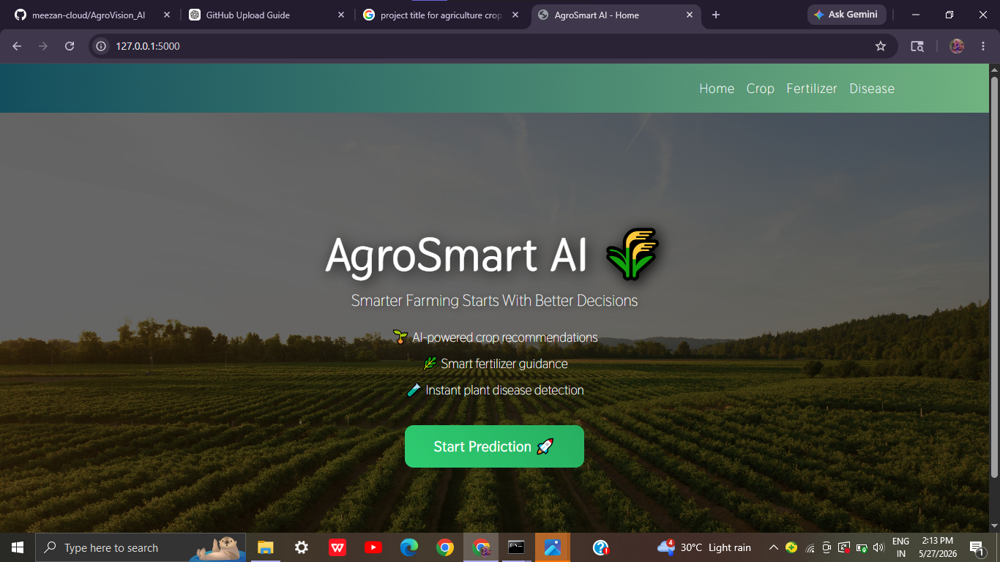
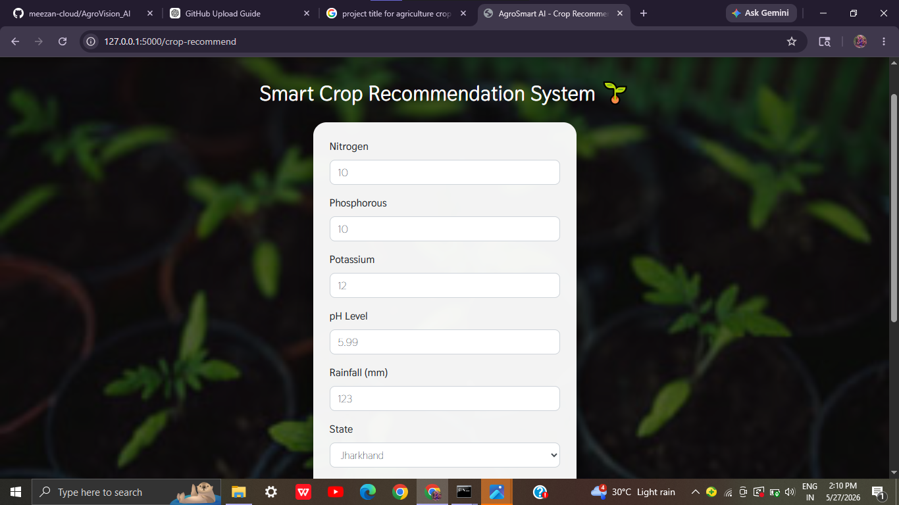
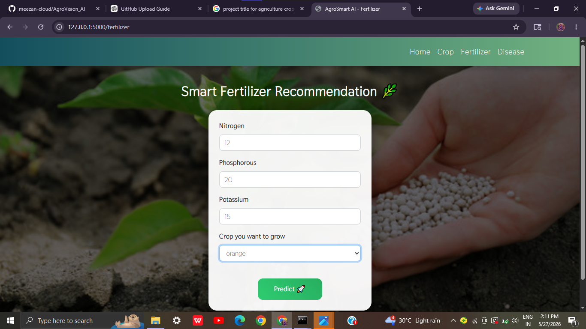

# 🌾 AgroSmart AI
### Smart Agriculture & Crop Intelligence System

AgroVision AI is an AI-powered smart agriculture platform that helps farmers make intelligent farming decisions using Machine Learning and Deep Learning technologies.

The system provides:
- 🌱 Crop Recommendation
- 🧪 Fertilizer Recommendation
- 🍃 Plant Disease Detection
- 📊 Smart Agricultural Insights

This project aims to promote precision farming and help improve agricultural productivity using AI.

---

# 🚀 Features

## 🌱 Smart Crop Recommendation
Recommends the best crop based on:
- Nitrogen (N)
- Phosphorus (P)
- Potassium (K)
- pH value
- Rainfall
- State information

Uses Machine Learning algorithms to predict the most suitable crop.

---

## 🧪 Fertilizer Recommendation
Provides fertilizer suggestions based on:
- Soil nutrient levels
- Crop type
- Soil deficiencies

Detects excess and deficiency of nutrients and suggests suitable solutions.

---

## 🍃 Plant Disease Detection
- Upload plant leaf image
- Detects plant disease using Deep Learning
- Predicts:
  - Crop type
  - Disease name
  - Disease causes
  - Prevention methods

---

# 🧠 Technologies Used

## 💻 Web Technologies
- Python
- HTML
- CSS
- JavaScript
- Bootstrap
- Flask

## 📊 AI / ML Libraries
- NumPy
- Pandas
- Scikit-learn
- PyTorch
- Matplotlib

---

# 📂 Project Structure

```bash
AgroVision_AI/
│── app/
│── models/
│── notebooks/
│── static/
│── templates/
│── screenshots/
│── requirements.txt
│── app.py
│── README.md
```

---

# 📸 Screenshots

## 🏠 Home Page


---

## 🌱 Crop Recommendation Form


---

## 📊 Crop Prediction Result


---

## 🧪 Fertilizer Recommendation


---

## 📋 Fertilizer Suggestion Result


---

## 🍃 Disease Detection Upload


---

## 🦠 Disease Detection Result


---

# ⚙️ Installation & Setup

## 1️⃣ Clone Repository

```bash
git clone https://github.com/meezan-cloud/AgroVision_AI.git
```

---

## 2️⃣ Navigate to Project

```bash
cd AgroVision_AI
```

---

## 3️⃣ Install Dependencies

```bash
pip install -r requirements.txt
```

---

## 4️⃣ Run Application

```bash
python app.py
```

---

# 🌐 How to Use

## 🌱 Crop Recommendation
Enter soil nutrient values and environmental conditions to get the best crop recommendation.

## 🧪 Fertilizer Suggestion
Input crop type and soil nutrient values to receive fertilizer recommendations.

## 🍃 Disease Detection
Upload a plant leaf image to detect diseases and receive prevention suggestions.

---

# 📊 Machine Learning Models Used
- Random Forest
- Naive Bayes
- SVM Classifier
- XGBoost
- CNN Deep Learning Models

---

# 🎯 Objectives
- Improve farming productivity
- Help farmers make smarter decisions
- Reduce crop disease losses
- Promote AI-based agriculture

---

# 🔮 Future Enhancements
- Real-time weather integration
- Mobile application support
- IoT-based farming system
- Voice assistant support
- Multi-language support

---

# 🤝 Contributing
Contributions and suggestions are welcome.

---

# 📜 License
This project is developed for educational and research purposes.

---

# 👩‍💻 Author

### Meezan Mulla
AI/ML Engineer 

---

# ⭐ Support

If you like this project, consider giving it a ⭐ on GitHub!
